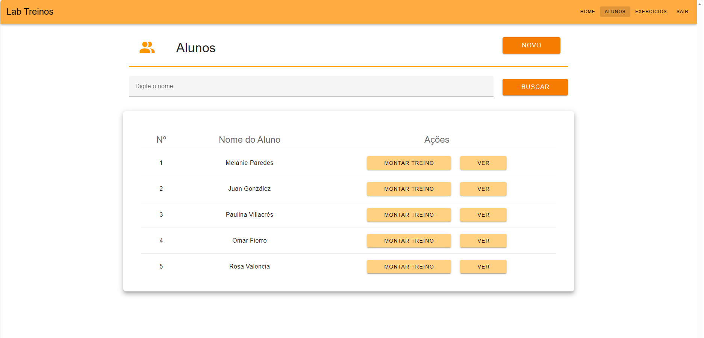

# Projeto TrainSys

Uma inovadora aplicação web feita para proporcionar excelência no gerenciamento de treinos.
Dedicada aos instrutores de academia para aprimorar a administração dos treinamentos de seus alunos.

## Índice
1. <a href="#funcionalidades">Funcionalidades do Projeto</a>
2. <a href="#layout">Layout</a>
3. <a href="#demostracao">Demostracao</a>
4. <a href="#rodar">Como rodar este projeto</a>

## 1. Funcionalidades do Projeto

- [x] Login
- [x] Cadastro Usuario
- [x] Dashboard	
- [x] Gerenciamento de Exercicios
- [x] Gerenciamento do Alunos
- [x] Cadastro Novo Aluno
- [x] Cadastro Treino
- [x] Visualização Treinos

## 2. Layout

